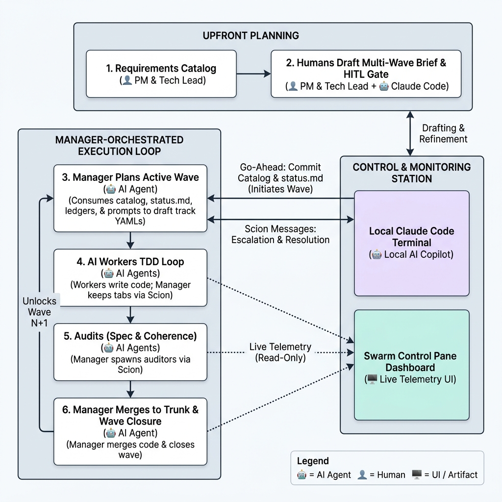
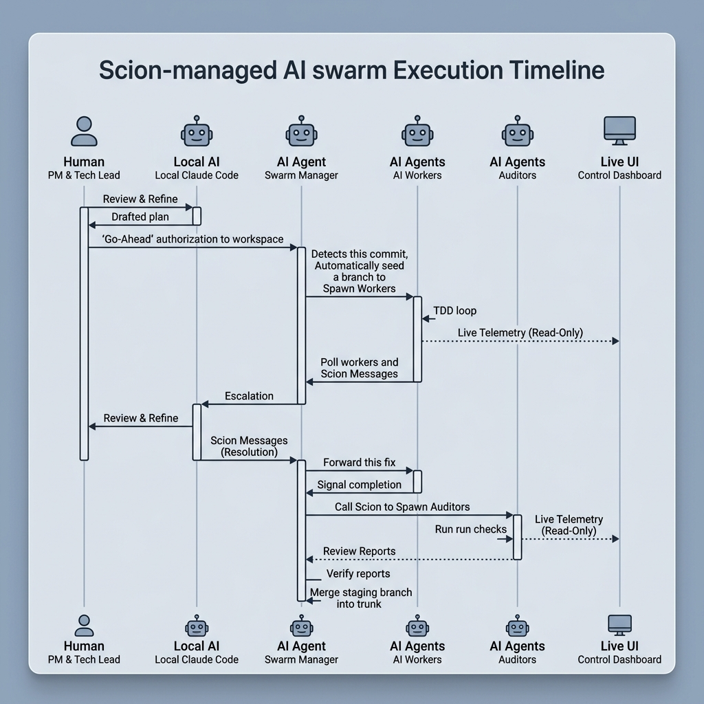
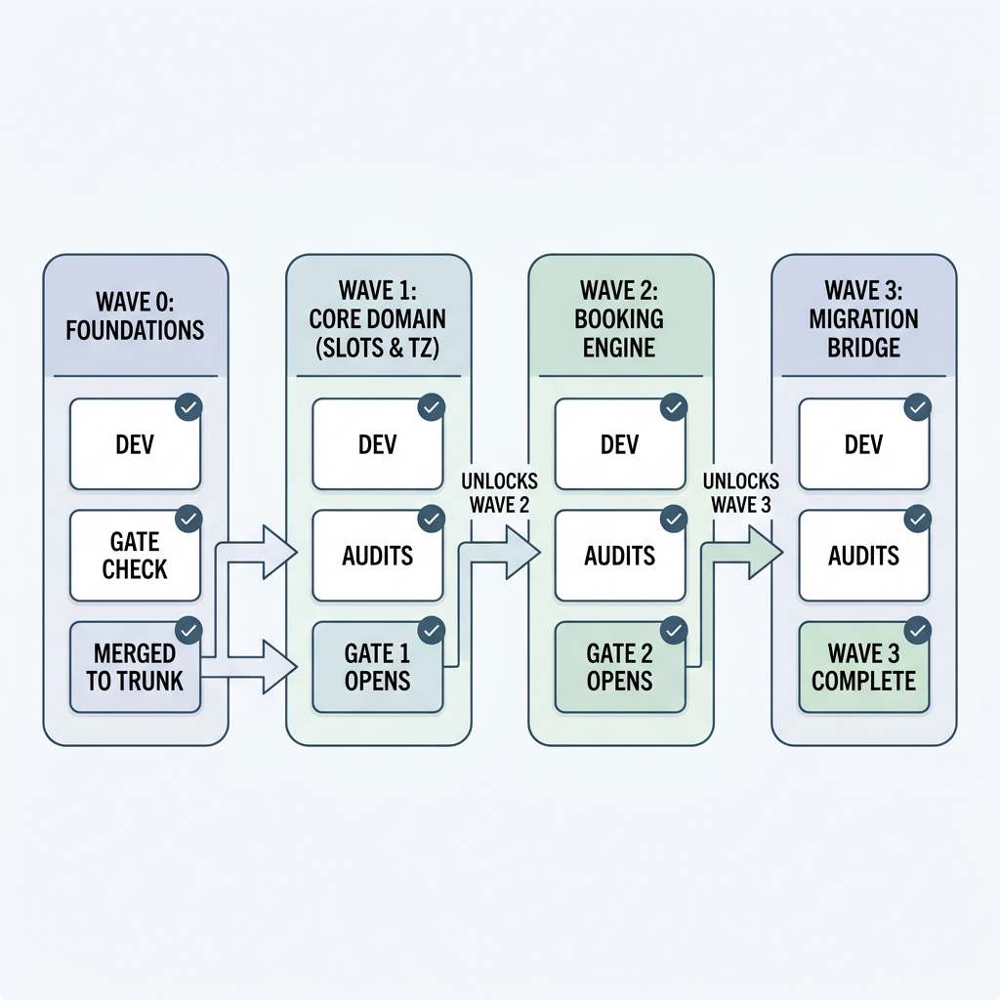

# Swarm Redesign Playbook: A Tag-Team Guide for PMs and Tech Leads

This guide details how a **Product Manager (PM)** and an **Engineering Lead (Tech Lead)** collaborate to design, launch, audit, and merge features using the multi-agent swarm orchestration system.

> [!NOTE]
> **Google Docs Import Tip:** Google Docs natively supports pasting markdown. You can copy this entire document and paste it directly into a blank Google Doc, or go to **File > Import** to import this file directly.

---

## 1. Executive Summary & The Tag-Team Model

Executing a service redesign with a swarm relies on **Spec-Driven Development**. The requirements catalog is the machine-readable and human-readable source of truth. 

To ensure the agents write high-fidelity code and tests, the PM and Tech Lead must work in lockstep. The division of ownership prevents code rot and behavioral drift:

| Role | Core Responsibility | Key Deliverables |
|---|---|---|
| **Product Manager (PM)** | Owns the **"What"** and the **Clinical/Business Rules** | Product Contracts, User Flows, Plain-English Acceptance Criteria |
| **Engineering Lead (Tech Lead)** | Owns the **"How"**, **Technical Contracts**, and **Process Integrity** | Technical Contracts, YAML Predicate Blocks, Ledgers, Gates & Merges |



---

## 2. Product Manager's Guide: Authoring Requirements

Requirements are stored in [requirements/](file:///Users/ashok.balakrishnan/projects/swarm-template/requirements) using the **REQ Spec v3** standard. Each requirement is either a single Markdown file or a structured folder (for large capability specs).

### Single-File vs. Directory Specs
*   **Use Single-File** ([template](file:///Users/ashok.balakrishnan/projects/swarm-template/requirements/_template-single-file.md)) for invariants (e.g., tenant isolation), external integrations, or small focused capabilities.
*   **Use Directory** ([template](file:///Users/ashok.balakrishnan/projects/swarm-template/requirements/_template-directory)) for major capability blocks (e.g., booking an appointment) where product prose and technical appendices are best separated.

### How to Structure a Requirement

Every requirement has four key sections:

#### A. Frontmatter (YAML)
Defines metadata, severity, and explicitly lists dependencies:
```yaml
---
id: REQ-CAP-BOOK-APPOINTMENT
schema_version: 3
name: Book an appointment
category: capability
severity: critical
status: proposed
owners:
  product: "@your-pm-handle"
  technical: "@your-tech-handle"
  qa: "@your-qa-handle"
reviewers:
  security: "@your-security-handle"
  data: "@your-data-handle"
tags: [capability, booking]
invariants_respected:
  - REQ-INV-TENANT-ISOLATION
  - REQ-INV-IDEMPOTENCY
events_emitted:
  - AppointmentBooked
business_rationale: |
  We need to support scheduling appointments programmatically to eliminate manual operations
  and reduce scheduling latency for clinics.
---
```

#### B. Product Contract (PM Owned)
Prose explaining the problem, the business goals, user personas (actors), non-goals, and detailed workflows with concrete examples.

#### C. Policy & Domain Rules (Joint Owned)
Detailed business constraints that transcend simple UI behavior. 
*Example: "A patient cannot book more than one primary care appointment per day."*

#### D. Acceptance Criteria (PM Prose / Tech YAML)
Each criterion needs a product-readable description followed by a structured machine predicate block authored by the Tech Lead.

> [!IMPORTANT]
> **PM Writing Rule:** Write criteria in explicit **Given-When-Then** format. Avoid passive or ambiguous language (e.g., write "The system MUST reject..." instead of "The system should probably show an error...").

---

## 3. Engineering Lead's Guide: Technical Contracts & Ledgers

The Tech Lead's primary job is to translate the PM's product goals into precise technical interfaces, security boundaries, and validation rules.

### A. Writing the Technical Contract
The Technical Contract section in `REQ-*.md` specifies:
*   **Data Model Changes**: Database tables, indexes, and schemas.
*   **API & Event Effects**: GraphQL queries/mutations, REST payloads, and JSON Schemas for events emitted.
*   **Security & Isolation**: Access control matrices, tenant boundary constraints, and PII protection rules.

### B. Defining YAML Predicates
For every acceptance criterion, you must supply a machine-readable `criterion` block that tests can assert against:

```yaml
criterion:
  id: validate-idempotency
  owner: technical
  severity: critical
  verification:
    level: integration
    required_tags:
      - "@req REQ-CAP-BOOK-APPOINTMENT @criterion validate-idempotency"
  predicate: |
    Sending the same idempotency-key twice returns the same response body
    and creates only one database record.
  negative_cases:
    - Resending the request with a mutated payload but same key returns ConflictError
  linked_invariants:
    - REQ-INV-IDEMPOTENCY
```

### C. Maintaining System Ledgers
The Tech Lead governs the codebase using four key files in [orchestration/ledgers/](file:///Users/ashok.balakrishnan/projects/swarm-template/orchestration/ledgers):

1.  **Agent Class Registry (`agent-class-registry.yaml`)**: Maps specific AI worker classes to their allowed folders and rules.
2.  **Contract Ledger (`contract-ledger.yaml`)**: The log of all API schemas, events, and database models.
3.  **Stub Ledger (`stub-ledger.yaml`)**: Every `TODO`, stub, mock, or fake in production code **must** be logged here with a named owner and expiry wave, or the gate check will fail.
4.  **Generated Artifacts Ledger (`generated-artifacts-ledger.yaml`)**: Logs files produced by code generators (e.g., GraphQL schemas, database types) to guarantee they are current.

---

## 4. The Swarm Execution Cycle (Step-by-Step)

The remote **Swarm Manager** is the sole orchestrator of the execution cycle. Humans (Tech Leads and PMs) author specs, authorize plans, and resolve escalations, but all agent work—including worker container spawning, code merging, and auditor execution—is strictly run and managed by the remote Manager.

> [!IMPORTANT]
> **Centralized Orchestration Authority:**
> *   **No Direct Worker Spawning**: Humans and local tools never invoke `scion start` commands to spawn workers or auditors. All execution is initiated automatically by the remote Manager agent container.
> *   **No Manual Merging**: Humans never manually merge worker branches into staging or trunk.
> *   **Manager-Driven Lifecycle**: The Manager agent acts as the central conductor, reacting to workspace commits and orchestrating the sibling agent containers from spawn to merge.



### Step 1: Spec Validation
Run the catalog compiler to verify that the requirements format and coverage criteria are valid:
```bash
cd tools/req-coverage
pnpm check
```

### Step 2: Humans Draft Multi-Wave Brief & HITL Gate (Claude Code Assisted)
The PM and Tech Lead (orchestrated via a **Local Claude Code session running Opus 4.7 in Max thinking mode**) analyze the requirements catalog, draft the overall multi-wave execution roadmap (e.g., `PHASE-2-CATALOG-DRIVEN-KICKOFF.md`), and run pre-flight checks for the active wave.

Before authorizing any wave, the PM and Tech Lead **must** review, refine, and sign off on the active wave's scope and requirements catalog. This review is conducted inside the **Local Copilot (Claude Code) session**, leveraging the local agent to audit the requirements and ensure readiness:

> [!IMPORTANT]
> **Human-in-the-Loop (HITL) Wave Planning Checklist (Claude-Assisted):**
> *   **Merge Collision Check (Tech Lead + Claude)**: Ask Claude to inspect whether parallel requirements target the same database tables or source files. If yes, have Claude serialize them or combine them to avoid merge storms.
> *   **Sequencing Check (Tech Lead + Claude)**: Ask Claude to check that schema migrations, database setup, and domain type configurations are sequenced *prior* to transport/application layers.
> *   **Priority Check (PM)**: Does the scope of this wave directly align with current clinical/business milestones?
> *   **Risk & Sizing Check (Tech Lead + Claude)**: Have Claude analyze if the active wave scope is sized appropriately. Limit the number of parallel tracks (maximum 3-4 concurrent tracks recommended) to ensure enough human triage capacity.

If adjustments are needed, Claude Code modifies the requirements files in the workspace directly. Once the plan is refined and approved, the Tech Lead commits the target catalog. This commit serves as the mechanical authorization for the Manager to plan and kick off the active wave:
```bash
git add requirements/*.md
git commit -m "[plan] authorize wave-N"
```

> [!NOTE]
> **Input Artifacts Consumed by the Swarm Manager on Go-Ahead:**
> When the Swarm Manager detects the authorization commit and boots, it consumes the following workspace artifacts to formulate the active wave plan:
> 1. **Roadmap & Directives**:
>    * [PHASE-2-CATALOG-DRIVEN-KICKOFF.md](file:///Users/ashok.balakrishnan/projects/swarm-template/orchestration/PHASE-2-CATALOG-DRIVEN-KICKOFF.md): Defines the multi-wave roadmap, track naming conventions, and in-scope requirements.
>    * `orchestration/status.md`: Tracks wave closure and marks the current active wave.
> 2. **Behavioral Specs**:
>    * [requirements/](file:///Users/ashok.balakrishnan/projects/swarm-template/requirements/): The catalog of `REQ-*.md` files containing plain-English rules and YAML predicate blocks (which serve as the source of truth for the wave's code behavior).
> 3. **System Ledgers & Regulators**:
>    * `orchestration/ledgers/agent-class-registry.yaml`: Maps agent classes to rule-packs and permissions.
>    * `orchestration/ledgers/contract-ledger.yaml`: Details API boundaries and contract schemas.
>    * `orchestration/ledgers/stub-ledger.yaml`: Specifies allowed stubs.
> 4. **Prompt Rule-Packs**:
>    * `orchestration/prompts/base.md` & `rule-packs/`: The frames and instructions used to assemble the workers' system prompts.
> 5. **Health Baselines**:
>    * `orchestration/baselines/`: Ledgers containing known trunk health regressions (preventing workers from failing due to pre-existing errors).

### Step 3: Manager Plans Active Wave & Spawns Workers
The remote **Swarm Manager** (running inside a Scion agent container with access to the Scion Hub API) detects this authorization commit and executes the wave planning and kickoff process **strictly for the active wave**:
1. **Plans the Active Wave (Drafts track YAMLs)**: The Manager reads the catalog and the active wave scope, and writes the concrete track configurations under [orchestration/track-meta/w<N>-<track-id>.yaml](file:///Users/ashok.balakrishnan/projects/swarm-template/orchestration/track-meta) mapping track IDs, target requirements, agent classes, and subscribed contracts/invariants.
2. **Composes Worker Prompts**: It constructs the worker system prompt for each track from the base prompts, rule-packs, and cross-cutting guidelines.
3. **Persists and Seeds**: It writes the composed prompt to `/workspace/orchestration/composed-prompts/<track_id>.md`, commits it to the trunk branch, pushes to origin, and seeds the worker's branch:
   `swarm/w<Wave-Number>-<Track-Name>`
4. **Spawns Worker Containers**: The Manager invokes the **Scion CLI** (routing requests to the Google Scion Hub) to launch the worker agents in parallel:
   ```bash
   scion start <track_id>-worker \
     --type default \
     --harness claude \
     --grove <your-service>-swarm \
     --branch swarm/<track_id> \
     "Begin. Read /workspace/orchestration/composed-prompts/<track_id>.md end-to-end as your operational context, then proceed per its PROTOCOL section."
   ```
5. **Verifies and Polls**: The Manager verifies the container booted successfully (`scion logs <track_id>-worker | head -1`) and begins polling the worker status using `scion agent status <track_id>-worker`.

### Step 4: AI Workers TDD Loop & Communication
The sibling worker agents checkout their branches and execute in a strict **Test-Driven Development** loop. The Manager keeps tabs on their progress and communicates with them via **Google Scion Messages** (using `scion message <track_id>-worker "<msg>"`):
1.  **Write Test (RED)**: Write a test asserting the YAML predicate. Tag with `@req REQ-ID @criterion ID`. Commit: `[test] <criterion-id> failing`.
2.  **Write Implementation (GREEN)**: Write code to pass the test. Commit: `[impl] <criterion-id> passing`.
3.  **No Batching**: Commit each criterion individually.

> [!WARNING]
> **Commit Order Enforcement:** The mechanical gate checks that the test commit occurred *before* the implementation commit. Out-of-order branches are automatically rejected.

> [!TIP]
> **Real-Time Telemetry:** While the swarm executes, the PM, Tech Lead, and stakeholders can monitor worker progress, live test runs, and audit states via the **Swarm Control Pane Dashboard** (typically hosted at `http://localhost:3000` or your team's telemetry portal). Live telemetry streams directly from active workers and audit runners to keep everyone aligned in real time.

### Step 5: Audits (Spec & Coherence)
After workers finish, the Manager spawns the `spec-adherence-agent` and `integration-coherence-agent` via Scion to audit the implementation files against requirements, YAML predicates, module wiring, generated types, and package dependency conflicts.
*   **If rejected**: The Manager parses the review reports and dispatches fix batches back to workers via Scion messages.
*   **If approved**: The Manager merges worker branches into a staging branch: `swarm/stage/w<N>-batch-<M>`.

### Step 6: Manager Merges to Trunk & Wave Closure
Once all audit reports are approved and mechanical gates pass, the Manager automatically merges the staging branch into the trunk branch, writes the Wave Closure Report under `orchestration/reports/w<N>-closure.md`, and loops back to Step 3 to unlock the next wave.

## 5. Multi-Wave Swarm Orchestration in Action (Example Lifecycle)

Large-scale developments (such as a full scheduler service redesign) are never built in a single swarm run. Instead, they are broken down into sequential, cumulative **waves**. Each wave delivers a stable subset of capabilities, updates database models, and opens an integration gate to unlock the next wave.



### The Progress of Waves

#### Wave 0: Foundations (The Core Setup)
*   **Goal**: Establish system infrastructure.
*   **Deliverables**: DB connections, RLS policies, message bus configuration, and baseline shared contracts.
*   **Sign-off**: Verified by the Tech Lead running initial `gate-check.sh` tests. Once merged to trunk, it unblocks Wave 1.

#### Wave 1: Core Domain (Slots & Timezones)
*   **Goal**: Implement baseline database schemas and core domain algorithms.
*   **Deliverables**: Slot aggregates, recurrence calculations, and timezone DST conversion libraries.
*   **Sign-off**: `G.wave-1-slots` gate opens. The Manager verifies slot-availability APIs. Once merged to trunk, it unblocks Wave 2.

#### Wave 2: Capability Integration (Booking & BPS)
*   **Goal**: Build user-facing business capabilities on top of Wave 1 foundations.
*   **Deliverables**: GraphQL booking resolvers, client booking workflows, and business validation engines.
*   **Sign-off**: `G.wave-2-booking` gate opens. Once merged, booking features are integrated. Unblocks Wave 3.

#### Wave 3: Migration Bridge & Decommissioning
*   **Goal**: Safely route production traffic and deprecate the legacy system.
*   **Deliverables**: Real-time migration bridge and data synchronization reconciliation tasks.
*   **Sign-off**: 30-day zero-drift verification. Wave 3 complete. Redesign fully landed.

---

### Cross-Wave Coordination Guidelines for the Tech Lead

*   **Feature Flagging**: All code delivered in Wave 2 and Wave 3 must be behind tenant-level feature flags (controlled via `REQ-INT-MIGRATION-BRIDGE`). This ensures code can be merged directly into trunk without breaking production.
*   **Database Migrations**: Database changes must follow the **Expand/Contract Pattern**. Wave 1 expands the schema (adds tables/fields). Wave 3 contracts the schema (deletes old fields) only after all traffic has safely migrated.
*   **Contract Ledgers**: Ensure that changes to API schemas in Wave N are updated in `orchestration/ledgers/contract-ledger.yaml` before spawning Wave N+1. This ensures worker agents in Wave N+1 read the correct contract boundaries.

---

## 6. Escalation Management via Local Copilot (Agent-to-Agent Loop)

When the remote **Swarm Manager** encounters an architectural conflict, ambiguous predicate, or a persistent gating failure, it does not guess. It halts and writes an escalation record under `/workspace/orchestration/escalations/<TS>-<topic>.md`.

The most effective way for the Tech Lead to resolve these escalations is to use a **Local Copilot Session** (e.g., Claude Code or Antigravity) as an agentic mediator:

```
[Swarm Manager Agent] <══(Scion Messages: Escalation & Resolution)══> [Local Copilot Session]
                                                                                ▲
                                                                                │
                                                                       (Reviews & Decides)
                                                                                │
                                                                        [Human Tech Lead]
```

### The Triage Loop

1.  **Ingestion**: When the Swarm Manager writes an escalation, the Tech Lead boots up their local interactive agent session (Claude Code / Antigravity) in the workspace.
2.  **Analysis (Max Effort Mode)**: The Tech Lead prompts the local agent to analyze the escalation:
    *   *Prompt: "Explain the escalation in `orchestration/escalations/20260520-tz-ambiguity.md`. Inspect the database schema and timezone specifications in the codebase, and tell me our options."*
3.  **Resolution Formulation**: The local agent leverages its high thinking budget to evaluate constraints, database sizes, or contract impacts, presenting the Tech Lead with clear, actionable solutions.
4.  **Local Execution**: The Tech Lead decides on the fix. The local agent immediately executes the change on the local workspace (e.g., adjusting Drizzle schemas, updating requirements markdown, or editing the `stub-ledger.yaml`).
5.  **Direct Scion Messaging**: The local agent connects directly to the Swarm Manager via Google Scion messages to transmit the approved resolution:
    ```bash
    scion message manager-agent "Approved Resolution: Adjusted Drizzle schema in db/schema.ts and updated stub ledger to allow temporary mock..."
    ```
6.  **Resume and Dispatch**: The Swarm Manager receives the Scion message, verifies the workspace changes, resolves the escalation, and automatically dispatches updated instructions to the AI worker agents to resume the execution loop.

---

## 7. Quick Reference: Common Fixes & Escalations

If a gate fails or an audit rejects a branch, refer to this routing table:

| Finding / Failure Kind | Reason | Action required |
|---|---|---|
| **`predicate_drift`** | Test doesn't assert what YAML predicate specifies | Dispatch back to worker to update the test assertions |
| **`impl_doesnt_honor_predicate`** | Test passes but impl bypasses the predicate rule | Dispatch back to worker to correct the business logic |
| **`sham_assertion`** | Test has generic asserts (e.g. `toBeDefined`) | Dispatch to worker to rewrite with high-fidelity assertions |
| **`catalog_defect`** | The YAML predicate is clinically/business-wise wrong | **Escalate to PM**. Update the requirement file first, then trigger fixes |
| **`no-production-stubs`** | A worker left an un-ledgered mock/todo in trunk | Either add it to `stub-ledger.yaml` with expiry, or write the real code |
| **`root-module-wiring`** | NestJS controllers/providers are not wired into AppModule | Wire the module, or mark as test/scaffold-only |

---

## 8. Appendix A: Standardized Claude Code Prompt Library

To ensure maximum determinism and consistency across different human engineering operators, the Tech Lead and PM **must** use the following structured prompt templates. Do not use open-ended queries. Copy and paste the appropriate template into your local interactive Claude Code session and supply the exact workspace parameters.

### Role Definition for Local Claude Code Session
```
You are the Local Copilot (Opus 4.7) acting as the Technical Audit Mediator for the multi-agent swarm. Your goal is to run precise checks, analyze local schemas/source files, and output structured, actionable summaries to help the Human Engineering Lead make deterministic decisions. Keep your responses highly technical, concise, and focused on code correctness.
```

### Prompt 1: Pre-Flight Wave Kickoff Audit (Tech Lead + PM)
*   **Goal**: Check the active requirements catalog for structural sequencing, schema collisions, and parallel capacity/risk before committing the wave kickoff.
*   **Prompt Template**:
```
[Paste Role Definition above first]

TASK: Run a Pre-Flight Wave Audit for the upcoming wave.

IN-SCOPE REQUIREMENTS:
- [Specify path, e.g., requirements/REQ-CAP-BOOK-APPOINTMENT.md]
- [Specify path, e.g., requirements/REQ-CAP-SLOT-MANAGEMENT.md]

LEDGER PATHS:
- Contract Ledger: orchestration/ledgers/contract-ledger.yaml
- Stub Ledger: orchestration/ledgers/stub-ledger.yaml

INSTRUCTIONS:
1. Scan the database definitions (e.g., db/schema.ts or equivalent schema files) and matching files in the codebase.
2. Check for Merge Collisions: Identify if the in-scope requirements modify the same database columns, tables, or source files.
3. Check Sequencing: Verify if database schema changes or core API definitions in these specs are properly sequenced BEFORE the application-level integrations.
4. Check Stub Registry: Verify if there are existing unexpired stubs in orchestration/ledgers/stub-ledger.yaml that could conflict with this wave.
5. Check Risk & Track Count: Ensure the total number of parallel worker tracks does not exceed 4.

OUTPUT FORMAT:
Produce a markdown table with these columns:
- [Requirement ID]
- [Potential Collision / Conflict]
- [Sequencing Correctness (Valid / Needs Adjusting)]
- [Actionable Resolution]

Conclude with a final verdict: "APPROVED TO KICKOFF" or "REJECTED - REQUIRES RE-SEQUENCING".
```

### Prompt 2: Requirement Spec & YAML Predicate Audit (PM + Tech Lead)
*   **Goal**: Validate that newly drafted requirement specs and YAML predicate blocks follow the REQ Spec v3 standard and contain high-fidelity assertions.
*   **Prompt Template**:
```
[Paste Role Definition above first]

TASK: Validate the formatting and predicate fidelity of a requirement specification.

SPEC PATH: [Specify path, e.g., requirements/REQ-CAP-BOOK-APPOINTMENT.md]

INSTRUCTIONS:
1. Check YAML frontmatter for compliance with REQ Spec v3 (verify keys: id, schema_version, owners, invariants_respected, events_emitted).
2. Parse the ## Acceptance Criteria section. Identify all YAML predicate blocks.
3. Check for low-fidelity or generic assertions in the predicates (e.g., "should work", "returns success", or mock assertions). They must specify exact inputs, outputs, database effects, and error codes.
4. Check that all negative cases are explicitly enumerated.
5. Verify that all referenced linked_invariants exist in the workspace requirements catalog.

OUTPUT FORMAT:
Provide a structured checklist:
- [ ] Frontmatter Structure: [Valid / Invalid - list missing keys]
- [ ] Predicate Fidelity: [Pass / Fail - list specific low-fidelity predicate IDs and suggest exact re-writes]
- [ ] Invariant Links: [Valid / Broken links]
```

### Prompt 3: Swarm Escalation Triage (Tech Lead)
*   **Goal**: Deterministically resolve errors and blockages written by the remote Swarm Manager under `/workspace/orchestration/escalations/`.
*   **Prompt Template**:
```
[Paste Role Definition above first]

TASK: Resolve Swarm Manager Escalation.

ESCALATION FILE: [Specify path, e.g., orchestration/escalations/20260520-tz-ambiguity.md]

INSTRUCTIONS:
1. Read the escalation file to extract the failure context, error code (e.g., predicate_drift, impl_doesnt_honor_predicate, catalog_defect, no-production-stubs), and target files.
2. Inspect the relevant database files, codebase source code, and spec files related to the escalation.
3. Determine the root cause of the error:
   - If predicate_drift: Compare the test code assertion to the YAML predicate.
   - If impl_doesnt_honor_predicate: Find why the source code implementation bypasses the business rules.
   - If catalog_defect: Assess what clinical/business rules in the spec are self-contradictory.
   - If no-production-stubs: Find the un-ledgered mock/todo in the implementation.
4. Formulate the exact code or specification change needed to resolve the blockage.

OUTPUT FORMAT:
Provide:
1. Root Cause Analysis: Concise explanation of why the failure occurred.
2. Exact Changes to Execute: Code diffs or requirements modifications.
3. Scion Message to Send: Write the exact `scion message manager-agent "..."` command to run in the terminal to notify the Manager of the resolution.
```

### Prompt 4: Wave Closure & Stub Decommissioning Audit (Tech Lead)
*   **Goal**: Check stubs and generated schemas at the end of a wave to make sure no technical debt leaks into the next wave.
*   **Prompt Template**:
```
[Paste Role Definition above first]

TASK: Run Wave Closure Audit.

ACTIVE WAVE: [Specify wave, e.g., Wave 1]

INSTRUCTIONS:
1. Read orchestration/ledgers/stub-ledger.yaml. Identify any stubs marked for expiration in this wave.
2. Scan the codebase to check if those expired stubs have been removed and replaced with production-ready implementations.
3. Verify that all files generated during this wave (e.g., GraphQL schemas, database types) match the entries in orchestration/ledgers/generated-artifacts-ledger.yaml.
4. Confirm that the current status file (orchestration/status.md) is ready to be updated to close this wave.

OUTPUT FORMAT:
1. Expired Stubs Found: List all stubs that were supposed to expire in this wave but are still in the codebase.
2. Generated Artifact Status: List any mismatch between the files on disk and the generated-artifacts-ledger.yaml entries.
3. Wave Readiness: State if the wave is clean to close.
```
